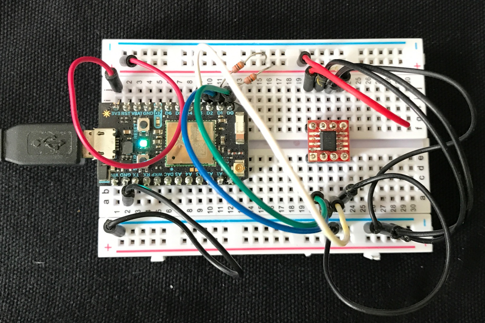

# DS75-RK

*Particle driver for DS75 I2C temperature sensor*

The DS75 isn't meant to be a super-accurate room temperature sensor like the BME280. It's ideal for measuring the temperature of circuit boards or the temperature inside an enclosure, however.

It's inexpensive (US$1.90 in single quantities) and tiny (SOIC-8 package), and you can connect 8 of them to a single I2C bus. 

I purchased mine at [Digi-Key](https://www.digikey.com/product-detail/en/maxim-integrated/DS7505S-/DS7505S--ND/2045448) along with the [SparkFun SOIC-8 to DIP Adapter](https://www.digikey.com/product-detail/en/sparkfun-electronics/BOB-13655/1568-1123-ND/5528943). It takes some careful soldering to solder a SOIC-8 by hand, but it's not bad if you have a good soldering iron after you've done it a few times.

## Pinouts

- 1 SDA
- 2 SCL
- 3 OS
- 4 GND
- 5 A2
- 6 A1
- 7 A0
- 8 VDD

The A lines are the I2C addressed and are not biased so you need to connect them either to VDD or GND. Tying all 3 to GND sets address 0.

OS is the thermostat output (optional).

Remember that this is a bare chip, so the SDA and SCL do not have built-in pull-up resistors, so make sure you have them on your I2C bus.


## Test Circuit

In this circuit, I made the following connections:

- 1 SDA to D0 (green)
- 2 SCL to D1 (blue)
- 3 OS to D2 (white)
- 4 GND to GND (black)
- 5 A2 to GND (black)
- 6 A1 to GND (black)
- 7 A0 to GND (black)
- 8 VDD to 3V3 (red)

Note that the DS75 is also 5V compatible, so if you want to run it on a 5V I2C bus with VDD at 5V, that is fine.

Don't forget the pull ups on SDA and SCL! They're the two 10K resistors connected to pins D0 and D1 on the Photon and 3V3.

The OS line (white) is optional. I use it only in example 2 for the interrupt handling.



## Examples

The DS75-RK.h header file has many comments that will help understand the calls.

### Simple Example

Using the temperature sensor is as easy as:

```
#include "DS75-RK.h"

const unsigned long PRINT_PERIOD_MS = 5000;
unsigned long lastPrint = 0;

DS75 temp(Wire, 0);

void setup() {
	Serial.begin(9600);
	temp.begin();
}

void loop() {
	if (millis() - lastPrint >= PRINT_PERIOD_MS) {
		lastPrint = millis();

		float tempC = temp.getTemperature();

		Serial.printlnf("temp %fC %fF", tempC, temp.convertCtoF(tempC));
	}
}
```

### Interrupt Example

The interrupt example is an interrupt in the sense that it detects high temperature and signals when the condition occurs. Instead of using an actual STM32F205 interrupt handler (attachInterrupt) the bit is just checked from loop. 

The reason is that in order to clear the interrupt, you need to read or write an I2C register, which can't be done from an interrupt handler. But the main reason you want an interrupt is that you are detecting a signal that changes state frequently or has a short pulse width you need to detect. Since the DS75 has a latching interrupt output, checking it from loop is a completely reasonable thing to do. 

Another helpful thing: The OS output on the DS75 is open-collector. This means if you have multiple DS75 sensors you can just connect all of their OS output to a single pin on the Photon/Electron. You can figure out which one triggered the alarm by reading the temperature values.


